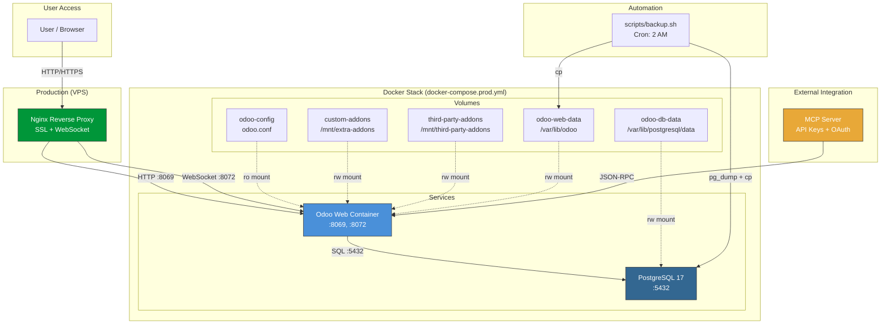
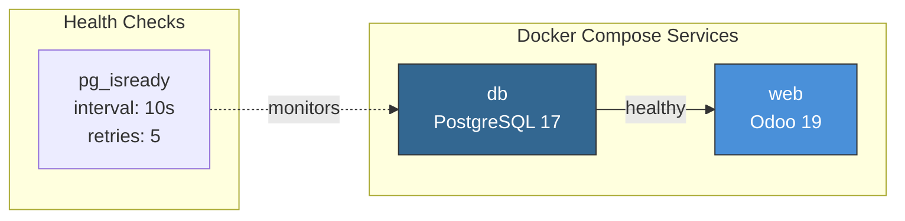
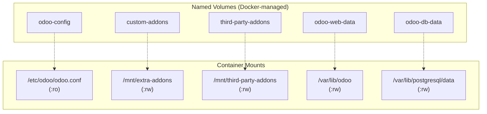
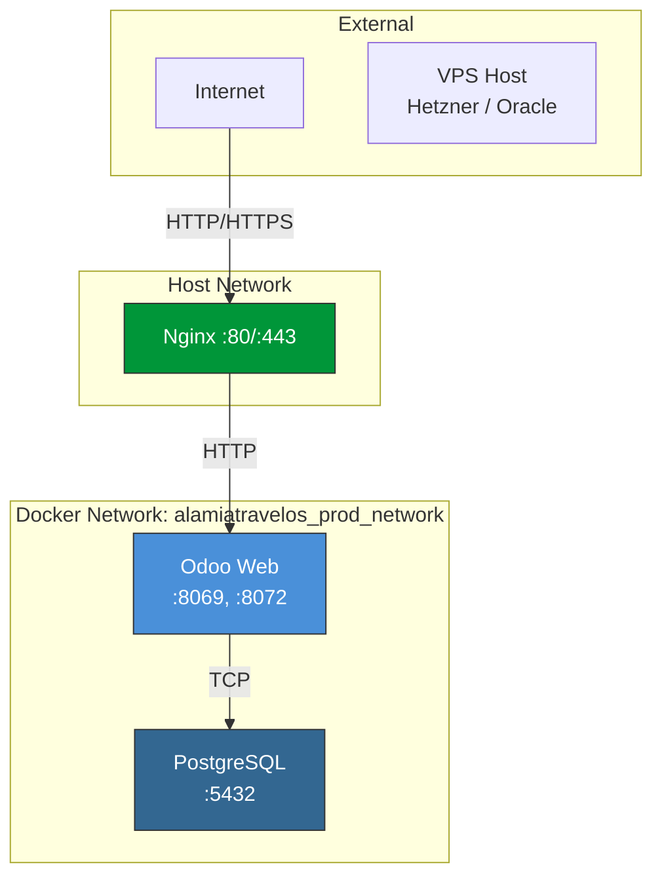
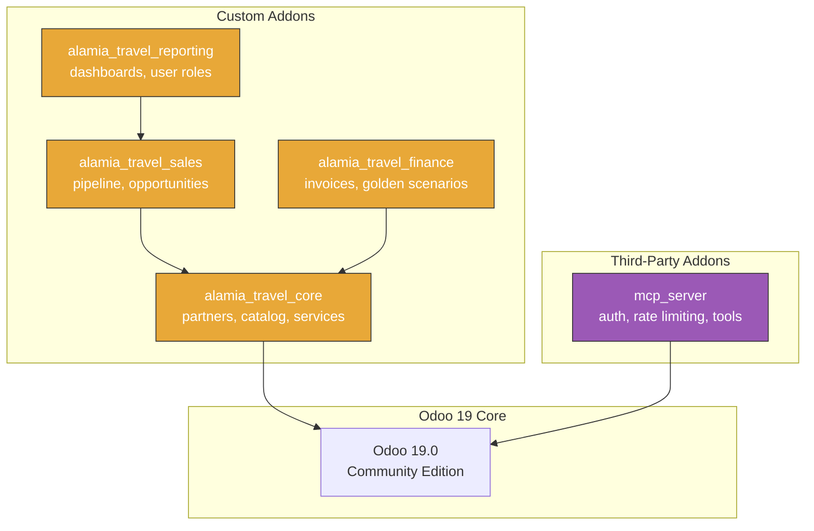

# Dependency Map — AlamiaTravelOS

## System Component Graph

```mermaid
graph TD
    subgraph "User Access"
        U[User / Browser]
    end

    subgraph "Production (VPS)"
        N[Nginx Reverse Proxy<br/>SSL + WebSocket]
    end

    subgraph "Docker Stack (docker-compose.prod.yml)"
        subgraph "Services"
            W[Odoo Web Container<br/>:8069, :8072]
            DB[PostgreSQL 17<br/>:5432]
        end

        subgraph "Volumes"
            V1[odoo-config<br/>odoo.conf]
            V2[custom-addons<br/>/mnt/extra-addons]
            V3[third-party-addons<br/>/mnt/third-party-addons]
            V4[odoo-web-data<br/>/var/lib/odoo]
            V5[odoo-db-data<br/>/var/lib/postgresql/data]
        end
    end

    subgraph "External Integration"
        MCP[MCP Server<br/>API Keys + OAuth]
    end

    subgraph "Automation"
        BK[scripts/backup.sh<br/>Cron: 2 AM]
    end

    U -->|HTTP/HTTPS| N
    N -->|HTTP :8069| W
    N -->|WebSocket :8072| W
    W -->|SQL :5432| DB
    V1 -.->|ro mount| W
    V2 -.->|rw mount| W
    V3 -.->|rw mount| W
    V4 -.->|rw mount| W
    V5 -.->|rw mount| DB
    MCP -->|JSON-RPC| W
    BK -->|pg_dump + cp| DB
    BK -->|cp| V4

    style W fill:#4a90d9,stroke:#333,color:white
    style DB fill:#336791,stroke:#333,color:white
    style N fill:#009639,stroke:#333,color:white
    style MCP fill:#e8a838,stroke:#333,color:white
```

## Service Dependencies

```mermaid
graph LR
    subgraph "Docker Compose Services"
        WEB[web<br/>Odoo 19]
        DB_SVC[db<br/>PostgreSQL 17]
    end

    subgraph "Health Checks"
        HC[pg_isready<br/>interval: 10s<br/>retries: 5]
    end

    DB_SVC -->|healthy| WEB
    HC -.->|monitors| DB_SVC

    style WEB fill:#4a90d9,stroke:#333,color:white
    style DB_SVC fill:#336791,stroke:#333,color:white
```

## Volume Mounts (Production)

```mermaid
graph TD
    subgraph "Named Volumes (Docker-managed)"
        VOL1[odoo-config]
        VOL2[custom-addons]
        VOL3[third-party-addons]
        VOL4[odoo-web-data]
        VOL5[odoo-db-data]
    end

    subgraph "Container Mounts"
        MOUNT1["/etc/odoo/odoo.conf<br/>(:ro)"]
        MOUNT2["/mnt/extra-addons<br/>(:rw)"]
        MOUNT3["/mnt/third-party-addons<br/>(:rw)"]
        MOUNT4["/var/lib/odoo<br/>(:rw)"]
        MOUNT5["/var/lib/postgresql/data<br/>(:rw)"]
    end

    VOL1 -.-> MOUNT1
    VOL2 -.-> MOUNT2
    VOL3 -.-> MOUNT3
    VOL4 -.-> MOUNT4
    VOL5 -.-> MOUNT5
```

## Network Topology

```mermaid
graph TD
    subgraph "External"
        EXT[Internet]
        VPS[VPS Host<br/>Hetzner / Oracle]
    end

    subgraph "Host Network"
        NG[Nginx :80/:443]
    end

    subgraph "Docker Network: alamiatravelos_prod_network"
        WEB[Odoo Web<br/>:8069, :8072]
        DB[PostgreSQL<br/>:5432]
    end

    EXT -->|HTTP/HTTPS| NG
    NG -->|HTTP| WEB
    WEB -->|TCP| DB

    style WEB fill:#4a90d9,stroke:#333,color:white
    style DB fill:#336791,stroke:#333,color:white
    style NG fill:#009639,stroke:#333,color:white
```

## Module Relationships

```mermaid
graph TD
    subgraph "Custom Addons"
        TC[alamia_travel_core<br/>partners, catalog, services]
        TS[alamia_travel_sales<br/>pipeline, opportunities]
        TF[alamia_travel_finance<br/>invoices, golden scenarios]
        TR[alamia_travel_reporting<br/>dashboards, user roles]
    end

    subgraph "Third-Party Addons"
        MCP_S[mcp_server<br/>auth, rate limiting, tools]
    end

    subgraph "Odoo 19 Core"
        ODOO[Odoo 19.0<br/>Community Edition]
    end

    TC --> ODOO
    TS --> TC
    TF --> TC
    TR --> TS
    MCP_S --> ODOO

    style TC fill:#e8a838,stroke:#333,color:white
    style TS fill:#e8a838,stroke:#333,color:white
    style TF fill:#e8a838,stroke:#333,color:white
    style TR fill:#e8a838,stroke:#333,color:white
    style MCP_S fill:#9b59b6,stroke:#333,color:white
```